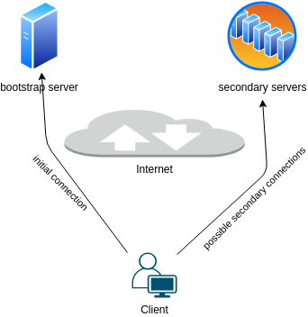

# Overview

*elbow* manages the connections from a client to one or more servers. The main advantage is that servers can change during the session which the client does not need to know about.

Communication between server is **not in scope** of *elbow*.

# Communication protocol

